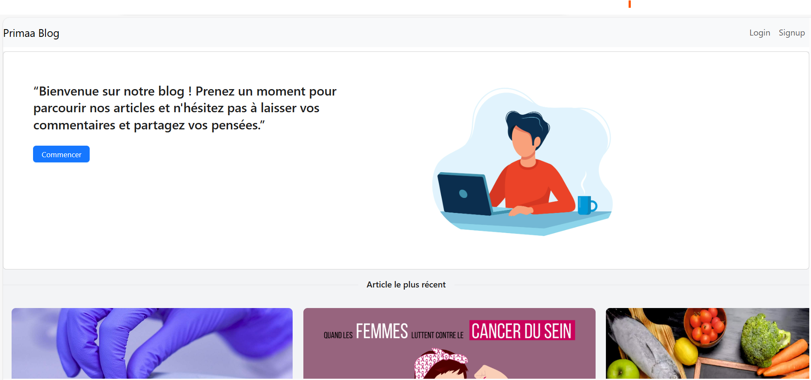
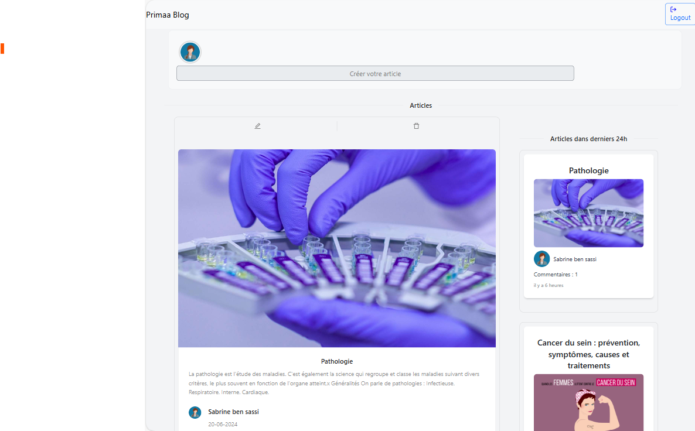
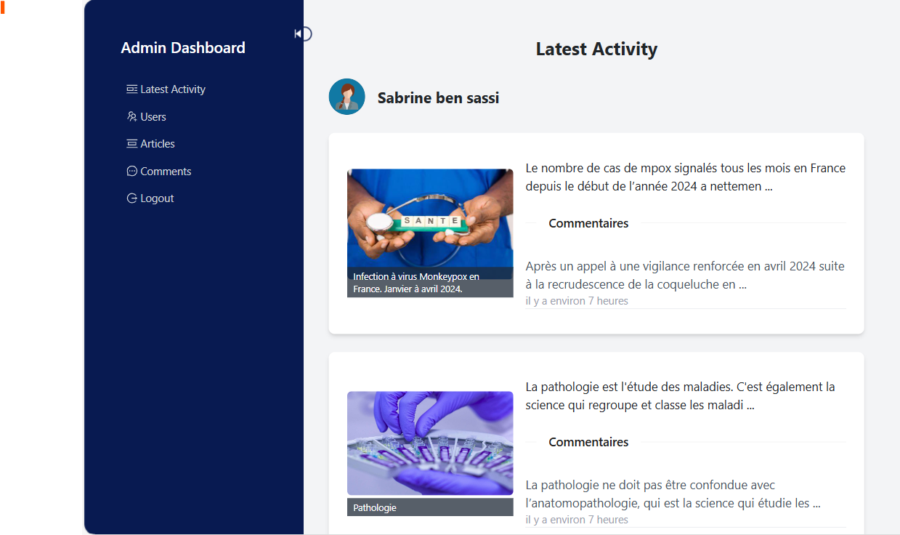

# Blog-app

## Table of contents

- [Introduction](#introduction)
- [Demo](#demo)
- [Features](#features)
- [Technology](#technology)

## Introduction

A blog application using the stack (Node js, Express js, Typescript, React js, Tailwind css, Mysql, Sequelize and Node js).

## Demo









## Technology

The main technologies used to build this application are:

- Node.js version 18.20.2
- Mysql version 4.4.3
- Express.js version 4.19.2
- Typescript: 5.4.5
- React.js version 18.3.1
- Antd, a React UI Framework, version 5.18.1
- Tailwind CSS version 3.4.4

## Architecture
To create a high-performance and scalable application,  I implemented Uncle Bob's clean architecture with typescript for the API part.

### Install tools

- [Docker desktop](https://www.docker.com/products/docker-desktop)
- [Docker compose](https://docs.docker.com/compose/install/)

### Setup infrastructure

- Start All services container

    ```bash
    docker-compose up -d
    ```

## Features

A blog app with the following features.

Unlogged in users can do the following:

- View all posts.
- Signin
- Signup.

In addition to the above points, logged in users can do the following:

- Login or logout.
- Create a new post.
- View/Edit/delete their posts.
- Add a new comment on a post.
- View/Edit/Delete their comments.

Logged admin can do the following:

- Delete any user, article, or comment
- View users who have commented more than once in the past 24 hours, along with the articles they commented on, and the comments
